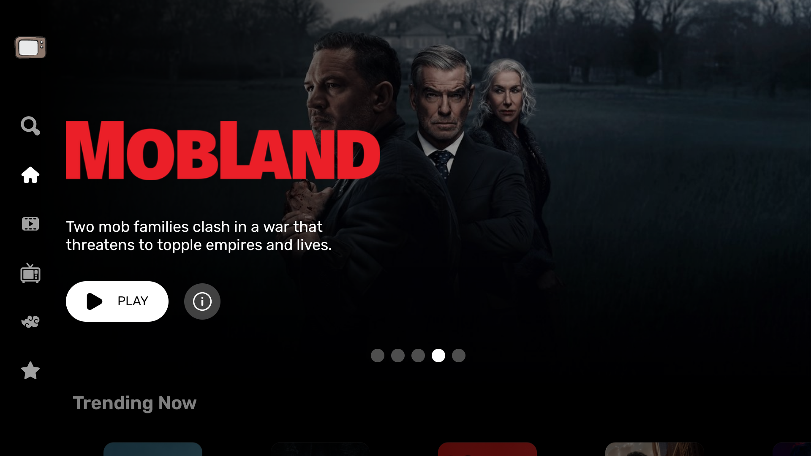
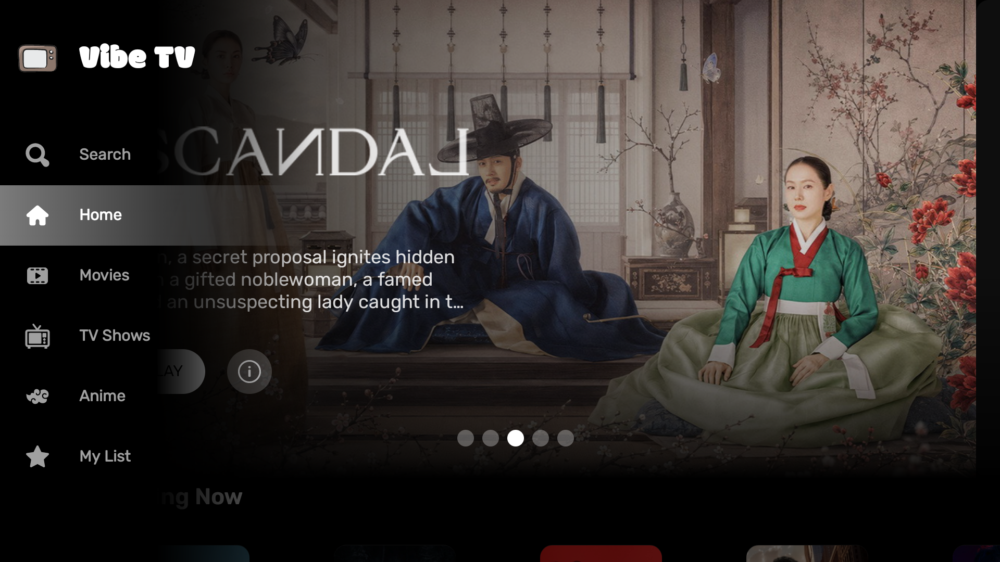
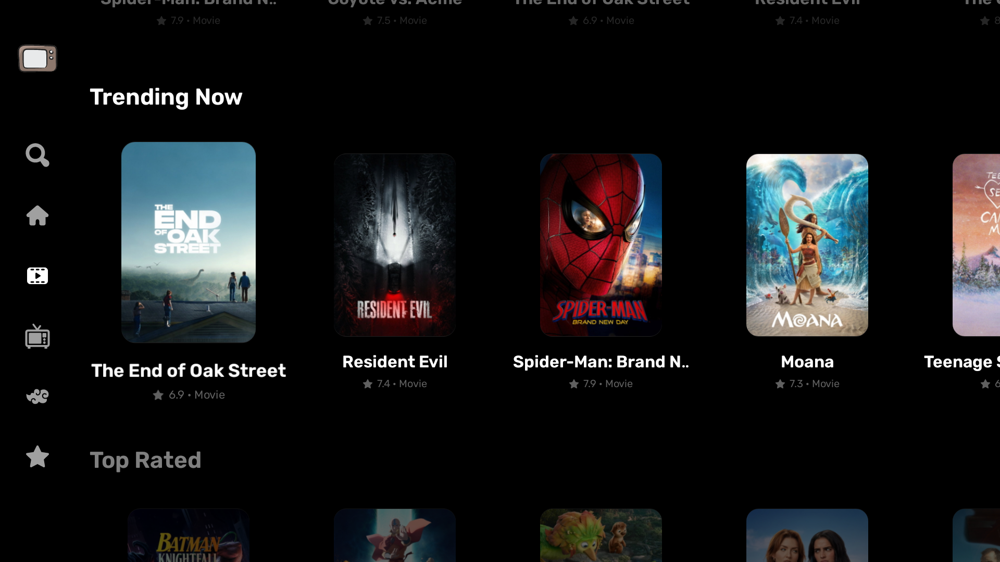
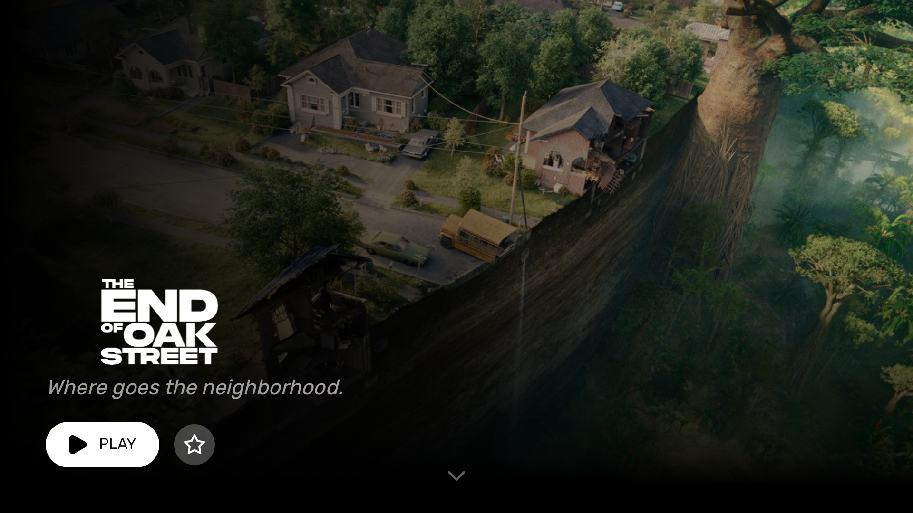
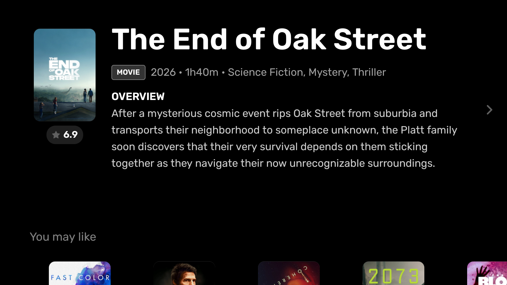
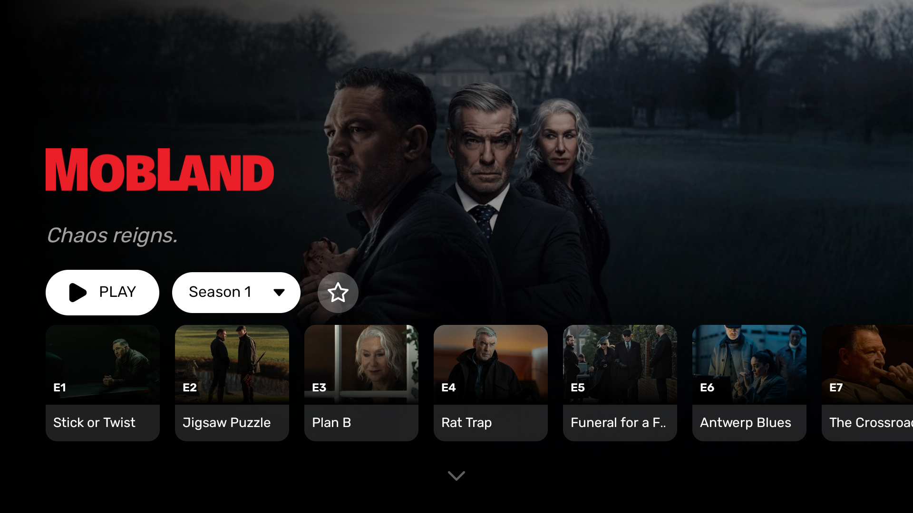
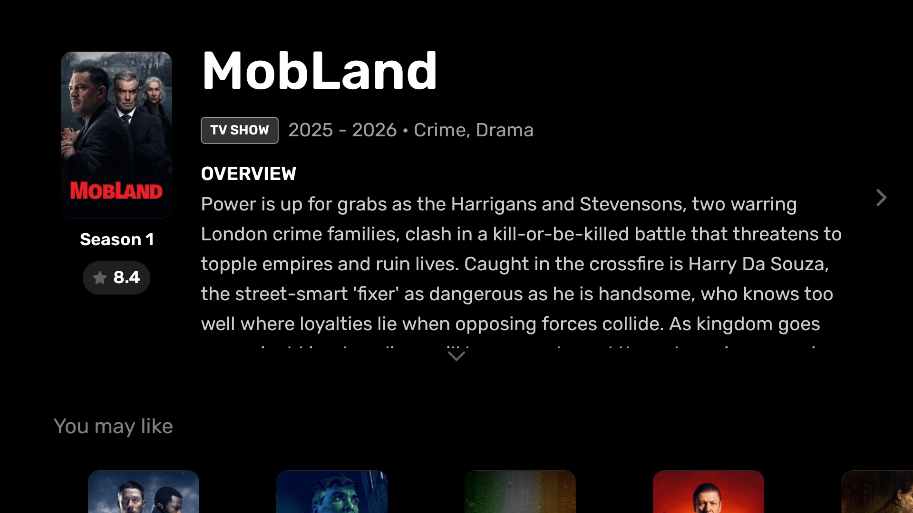
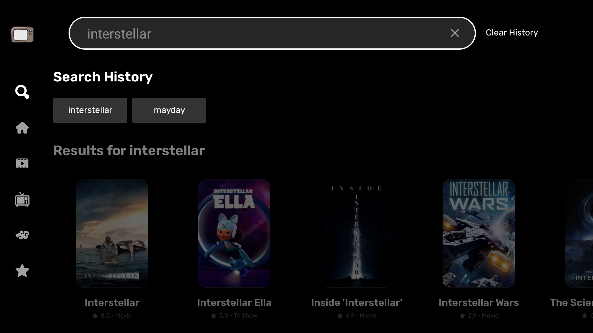
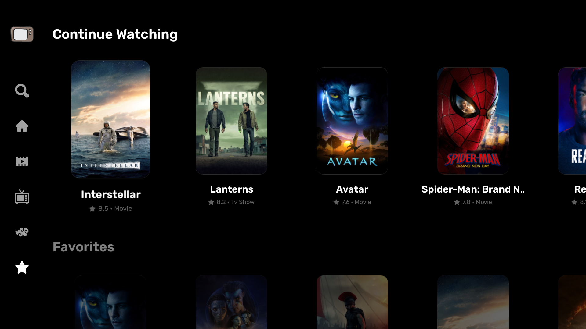
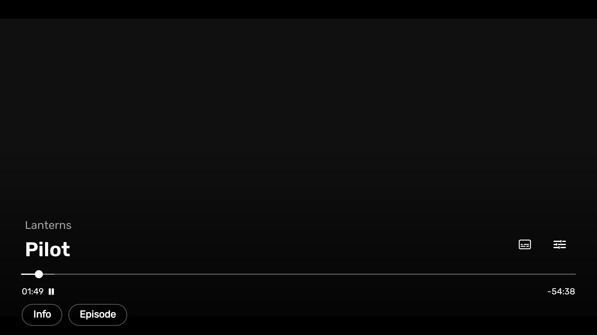

# VibeTV

A modern Android TV application for exploring movies, TV shows, and anime through a simple, TV-friendly interface.

  

## Features

* Browse movies and TV shows
* Discover anime
* Search for movies, TV shows, and anime
* View ratings, descriptions, genres, and other details
* Browse recommendations and similar titles
* TV season and episode browsing
* Subtitle support
* Multiple video quality options
* Designed specifically for Android TV
* Full D-pad / remote control support
* TV-optimized interface and navigation

## Screenshots

### Navigation

  

### Tabs

  

### Movie Details

  
  

### TV Shows Details

  
  

### Search

  

### My List

  

### Player

  

> Screenshots are provided to showcase the application's interface and features.

## Installation

VibeTV is distributed as an APK through GitHub Releases.

1. Open the **Releases** section of this repository.
2. Download the latest APK.
3. Transfer the APK to your Android TV device.
4. Install the APK.
5. Launch VibeTV from your applications.

> Android TV may require installation from unknown sources to be enabled.

## Releases

Download the latest version from the repository's **Releases** page.

Each release includes the corresponding APK and release notes.

## Requirements

* Android TV / Google TV
* Android 6.0 (API 23) or later
* Internet connection

## Disclaimer

VibeTV is a personal project created for educational and personal use.

VibeTV does not host or store movies, TV shows, anime, video files, or subtitles. The application acts as a client for retrieving metadata and accessing content from third-party services.

Users are responsible for ensuring that their use of the application complies with applicable laws, regulations, and the terms of the services they access.

## Credits

Movie and TV metadata is provided by [TMDB](https://www.themoviedb.org/).

This product uses the TMDB API but is not endorsed or certified by TMDB.

## Source Code

The source code for VibeTV is maintained privately and is not publicly available.

This repository is intended for:

* Application releases
* APK distribution
* Release notes
* Screenshots
* User-facing documentation

## License

© 2026 rxdlcz. All rights reserved.

The VibeTV application and its source code are not open source unless otherwise stated.

---

  <b>VibeTV</b> 
  Made for Android TV

